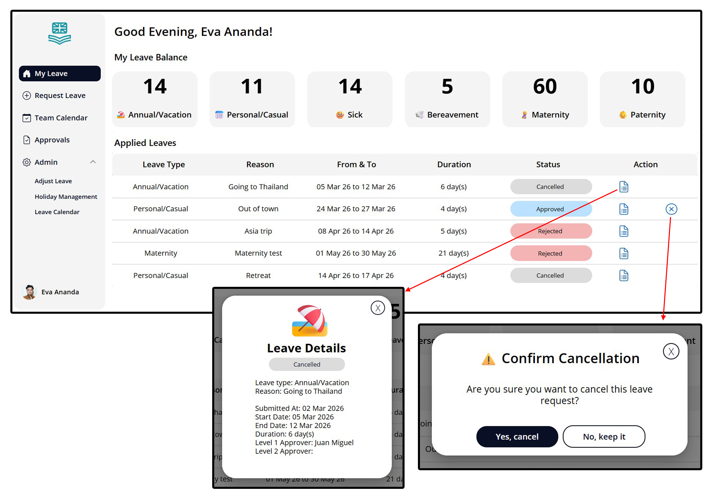

# Leave Management System - Power Apps

A leave management solution built using Microsoft Power Apps and Power Automate within the Microsoft 365 ecosystem.

The application allows employees to submit leave requests, managers to approve or reject requests, and administrators to manage leave balance and company holidays.

## Technologies
- Microsoft Power Apps (Canvas)
- Power Automate
- SharePoint
- Microsoft 365

## Key Features
- Leave request submission with automatic duration calculation
- Weekend and public holiday exclusion
- Overlap validation for leave requests
- Manager approval workflow
- Email notifications for approvals, rejections, and adjustments
- Leave balance tracking and automatic balance restoration

## Screenshots
### Dashboard

### Leave Request Form
### Approval Workflow
